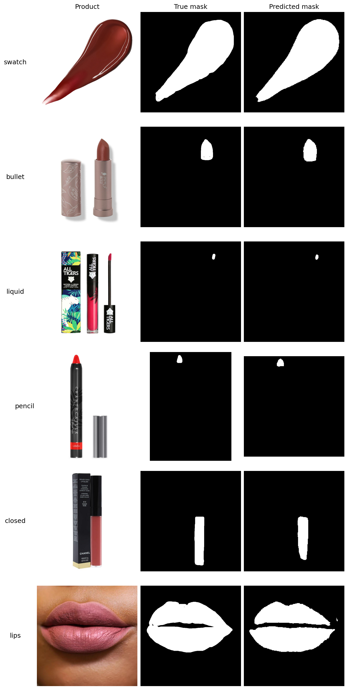
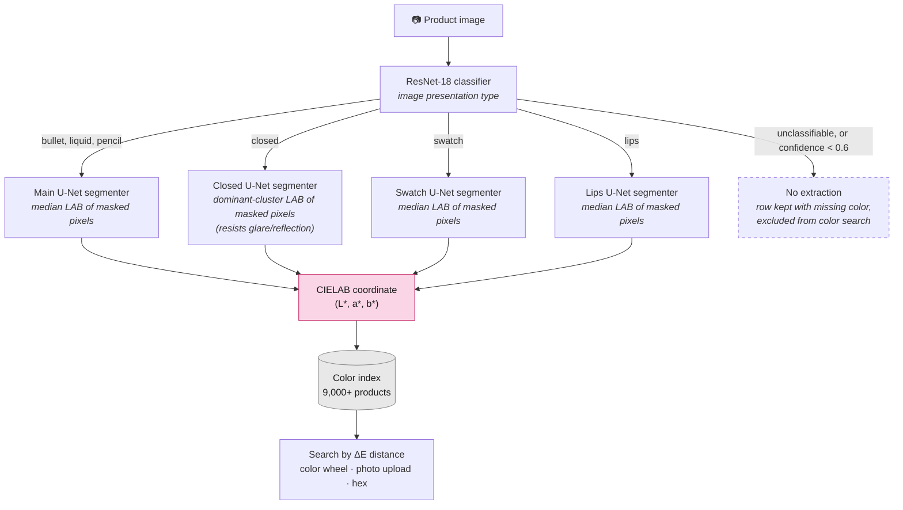

# Lipstick Color Finder: ML-Powered Color Search Across 9,000+ Products

**tl;dr:**

- **Goal:** Identify the color of lipstick products in CIELAB color space to enable comparison by standardized shade rather than by the creative names brands assign.

- **Data:** 9,000+ product images and metadata collected from makeup retailers via API and web scraping; human-labeled data annotations built separately for training and out-of-sample evaluation.

- **Methods:** A hybrid two-stage pipeline: a fine-tuned ResNet-18 classifies each image by presentation type (bullet, closed, lips, liquid, pencil, swatch, unclassifiable), which routes it to a type-specific U-Net segmenter that isolates the color region, followed by shade extraction from the masked pixels, and an explicit no-extraction branch when no color is visible. Evaluated against ground truth with Delta E CIE 2000 (90.5% of the validation set falls well under the ~2.3 just-noticeable-difference threshold); a Gaussian Mixture Model clusters the catalog for color-based browsing.

- **App:** Web interface for searching 9,000+ lip products by color: color wheel, photo upload, or hex input.

- **Tech stack:** Python, PyTorch, Jupyter, OpenCV, scikit-learn, Label Studio.

---

> **App** Try it at [lipstickbycolor.github.io](https://lipstickbycolor.github.io/). Source code at [github.com/LipstickByColor](https://github.com/LipstickByColor).

---

In what follows, I provide an in-depth overview of the project. 

> **For a high-level overview see [here](https://lipstickbycolor.github.io/about.html)**

---

*Table of Contents*
- [Overview: Problem and Solution](#overview-problem-and-solution)
- [Methods Overview](#methods-overview)
- [Training, Validation & Test Sets: Curation, Sampling, and Annotation](#training-validation--test-sets-curation-sampling-and-annotation)
- [Stage 1: Image-Type Classifier](#stage-1-image-type-classifier)
- [Stage 2: U-Net Segmentation + Robust Extraction](#stage-2-u-net-segmentation--robust-extraction)
- [Stage 3: Color extraction from the masked region](#stage-3-color-extraction-from-the-masked-region)
- [End-to-End Evaluation](#end-to-end-evaluation)
- [Production Run & Color Index](#production-run--color-index)
- [Citation](#citation)

## Overview: Problem and Solution

Lipsticks come in every color and shade imaginable, but finding a specific color or shade online is surprisingly difficult.

First, brand naming is inconsistent and opaque. Brands use evocative names like "Velvet Plum," "Midnight Berry," and "Spiced Rosewood" that don't map to a specific color. 

<table border="0" cellspacing="0" cellpadding="0">
  <tr>
    <td width="60%" valign="top" style="border: none;">Even when a color appears in the name, it isn't consistent across or within brands.  All of the shades to the right, for instance, are called **mauve** by different brands.</td>
    <td width="40%" align="center" style="border: none;"></td>
  </tr>
</table>

Second, search and filtering tools are inadequate. Retailers, like Sephora and Ulta, offer limited color filters that collapse the entire spectrum into a handful of broad buckets. 

<div align="center">
<table>
  <tr>
    <td align="center"><b>Sephora</b><br></td>
    <td align="center"><b>Ulta</b><br></td>
  </tr>
</table>
</div>

Others, like Amazon and Google Shopping, offer no color filters at all, forcing users to search by name. While "pink" or "red" might feel obvious, shades like mauve, dusty rose, or terracotta are ambiguous. And there's no guarantee the search engine returns useful results.

Third, even filtering or searching for "Pink" lipsticks returns hundreds of results spanning wildly different shades such as the ones below.


<table>
  <tr>
    <td align="center" width="25%"><b>Amazon</b><br></td>
    <td align="center" width="25%"><b>Google Shopping</b><br></td>
    <td align="center" width="25%"><b>Sephora</b><br></td>
    <td align="center" width="25%"><b>Ulta</b><br></td>
  </tr>
</table>

Given these limitations, it's not only hard to discover and search for lipsticks, but comparing shades across brands or finding a cheaper alternative to a known favorite is very time consuming.

### Web App

By mapping lipstick colors to the [CIELAB color space](https://lipstickbycolor.github.io/color-guide.html), I create a standardized, perceptually uniform representation that enables accurate shade comparison across brands. CIELAB represents color in three dimensions: L (lightness), a (green to red), and b (blue to yellow). Equal numerical differences in CIELAB correspond to roughly equal perceived differences to the human eye. This is the same standard cosmetics manufacturers use internally for color quality control, and it makes the matching problem measurable: the distance between two colors (Delta E) directly quantifies how different they look.

The app allows for multiple ways to search for lip products by color: **Search by color wheel**, **Search by photo**, **Search by hex.** Products can be saved to a **wishlist** for easy comparison across shades and brands, and as a starting point of future searches. Results are ranked by Delta E. 

Below are some illustrations from the app:

<table>
  <tr>
    <td width="33%" align="center"><b>Color wheel, pick a color</b></td>
    <td width="33%" align="center"><b>Zoom into a selected color</b></td>
    <td width="33%" align="center"><b>Photo upload and select color</b></td>
  </tr>
  <tr>
    <td width="33%"></td>
    <td width="33%"></td>
    <td width="33%"></td>
  </tr>
  <tr>
    <td width="33%"></td>
    <td width="33%"></td>
    <td width="33%"></td>
  </tr>
</table>

> **Test the app** [lipstickbycolor.github.io](https://lipstickbycolor.github.io/).  

---

## Methods Overview

The core challenge, given a raw retailer product image, is to recover the true lipstick color as a CIELAB coordinate. The difficulty is that the lipstick color is usually a *small region* of the image — a bullet tip, a doe-foot applicator, a smear visible through transparent packaging — surrounded by packaging, backgrounds, and shadows that dominate the pixel count.

The right way to extract color depends on what kind of image you're looking at. A swatch *is* the color; a bullet shot is mostly tube; a windowed container shows the color only through plastic. So the architecture is three stages:

1. **Stage 1 — Classify:** a fine-tuned ResNet-18 identifies each image's presentation type (`bullet`, `closed`, `lips`, `liquid`, `pencil`, `swatch`, `unclassifiable`).

2. **Stage 2 — Segmentation:** fine-tuned **U-Net segmentation** that isolates the color-bearing region. 

3. **Stage 3 — Extract:** Extract the color from the masked pixels.

Extraction is scored against human-annotated ground truth using **Delta E CIE 2000 (ΔE)**, the perceptual color-difference metric where values under ~2.3 are imperceptible to the human eye.

---

## Training, Validation & Test Sets: Curation, Sampling, and Annotation

No benchmark dataset exists for evaluating lipstick-image color extraction, presentation-type classification, and color-region segmentation, so I built one. The annotation set has to do three different jobs: train the models, select among them, and report performance. These jobs call for different sampling, so I designed them separately instead of splitting one dataset at random.

**The sampling constraint:** The models consume images, but the only signal available for deciding which images to annotate is retailer metadata which does not provide much information on image types and provides inconsistent information across brands on other issues (e.g. color family, type of lipstick container). 

**Different sets, different objectives:** A training set needs to be informative by covering every region of the input space the model has to handle, even regions that are rare in the catalog. A validation and test set needs to be representative by approximating the production distribution closely enough that reported metrics reflect expected real-world performance while containing enough examples of important subgroups to support meaningful per-class evaluation. That's why I follow a different strategy for creating the training set and the validation and test sets.

### Training Set Strategy

Images are drawn in three ways, each closing a different coverage gap:

* Color taxonomy:  I consolidated the 200+ inconsistent `parent_color` values from the raw brand and retailer metadata into 18 color groups using a keyword-based, [LLM-assisted taxonomy](notebooks/03_a_training_set_strategy.ipynb). Then used Cochran's formula with the CIELAB L* standard deviation from a prior analysis I did as the variance estimate and stratified across the 18 color groups with a floor of 5 per group, so rare shades like deep purples and true oranges aren't skipped. Below are color swatches from the training data sampled proportionally to the color taxonomy:

<div align="center">  </div>

* Embedding-based style discovery: Embedded and clustered all unlabeled images to surface visually similar groups not captured by metadata or color taxonomy. Sampled from clusters to improve coverage of unknown or rare visual modes (e.g., packaging variants, unusual photography, on-lips shots, composites), increasing the information value of the training set beyond metadata-based sampling.

* Rare-type oversampling: An initial annotation pass surfaced which image labels are underrepresented. Rare classes were oversampled using both the embedding-based clusters and metadata (e.g. keywords such as `pencil`/`crayon`).

The final training set has 392 products and images. Below are the images annotated by category. The mean ΔE across the labeled set is 30.5, confirming broad coverage of the lipstick color space rather than concentration in a few popular shades.

<div align="center">
  
</div>


### Validation & Test Set Strategy

Validation and test sets are drawn from a fully held-out pool: the catalog minus every image that touched training, model selection, or active learning.

**Sample size:** I set a target margin of error for each validation metric and used it to calculate the required sample size with a finite-population correction. For each evaluation group, the largest requirement across metrics became the minimum sample size.

**Visual representation:** Because metadata provides limited information about image presentation, I embedded the held-out image pool using ResNet-50, PCA, and Bisecting K-Means (50 clusters). I manually reviewed the clusters to identify broad visual groups. I then sampled proportionally across these groups so that visually similar images (e.g., the same packaging, angle, or lighting) did not dominate the sample.

**Subgroup coverage:** Proportional sampling alone would leave some visually defined groups too small for meaningful class-level metrics. I therefore oversampled `lips`, `closed`, `pencil`, `liquid`, and `unclassifiable` images until they reached their required sample-size floors.

The final validation set contains **483 images**.

### Annotation in Label Studio

The training, evaluation, and test sets are annotated in Label Studio.

Each image receives one of seven presentation-type labels: `swatch`, `bullet`, `liquid`, `closed` (color visible through a window), `lips` (product shown on-lips rather than in its container), `pencil` (also lip crayon), and `unclassifiable`. `unclassifiable` merges two dead-end cases that get the same downstream treatment (no color extraction): a sealed tube or container with no lipstick color visible, and a stock photo showing several products, a palette, or otherwise not a single product shot. The `unclassifiable` class is retained as a first-class label so the production pipeline can decline color extraction rather than return an incorrect color.

<table>
  <tr>
    <td align="center" width="25%"><b>Swatch</b><br></td>
    <td align="center" width="25%"><b>Bullet</b><br></td>
    <td align="center" width="25%"><b>Liquid</b><br></td>
    <td align="center" width="25%"><b>Closed</b><br></td>
  </tr>
  <tr>
    <td align="center" width="25%"><b>Pencil</b><br></td>
    <td align="center" width="25%"><b>Lips</b><br></td>
    <td align="center" width="25%"><b>Unclassifiable</b><br></td>
    <td width="25%"></td>
  </tr>
</table>

Moreover, images with visible product color are *annotated with a pixel-level mask* covering the color-bearing region. These masks serve two purposes: training the segmentation models, and defining the region used to derive reference color labels. For each annotated image, the CIELAB value is computed over the masked pixels, producing a human-supervised reference color label. 

The final annotation set therefore contains presentation-type labels, segmentation masks for images with visible product color, and reference CIELAB color labels derived from the annotated masks. 

---

## Stage 1: Image-Type Classifier

A fine-tuned ResNet-18 (ImageNet-pretrained) classifies each image as `bullet`, `closed`, `lips`, `liquid`, `pencil`, `swatch`, or `unclassifiable`.


**Technical Details:**

- **Why ResNet-18 + transfer learning?** The labeled set is small (392 images), which rules out training from scratch. ResNet-18 also has several advantages:
  - It's small, so it's forced to learn general features; a larger model would simply memorize 200 images and fail on unseen ones.
  - The task is coarse rather than fine-grained, so ImageNet features transfer almost directly.
  - It fine-tunes in minutes on a laptop GPU.

- **Two-phase fine-tuning.** The classification head is randomly initialized, so its early gradients are large and noisy. A single-phase full fine-tune would corrupt the pretrained features before the head stabilizes. So:
  - Phase 1 (5 epochs, backbone frozen): the head converges against fixed pretrained features.
  - Phase 2 (15 epochs, full network, lower learning rate): the backbone adapts gently to product photography.

- **Weighted cross-entropy.** Swatches outnumber the rarest classes ~7×, so an unweighted loss would let the model buy accuracy by over-predicting `swatch`. Inverse-frequency weights penalize errors on rare classes proportionally more.

- **Augmentation.**  Training images get a random horizontal flip and light color jitter (±20% brightness/contrast/saturation). The labeled set is small, so this discourages the model from memorizing exact pixel values. 

**Validation:** 87% accuracy (weighted-avg F1 0.87), on the real held-out validation set (`labels_val.csv`, N=480):

| Class | Precision | Recall | F1 | Support |
|---|---|---|---|---|
| `bullet` | 0.83 | 0.99 | 0.91 | 127 |
| `closed` | 0.35 | 0.67 | 0.46 | 12 |
| `lips` | 0.79 | 1.00 | 0.88 | 11 |
| `liquid` | 0.91 | 0.92 | 0.92 | 103 |
| `pencil` | 0.90 | 0.79 | 0.84 | 24 |
| `swatch` | 0.99 | 0.88 | 0.93 | 170 |
| `unclassifiable` | 0.59 | 0.30 | 0.40 | 33 |

`closed` and `unclassifiable` are the weak spots: both are rare in training, and `unclassifiable` in particular is easy to confuse with `bullet` or `liquid` when a photo is a composite of many lip products. 

This classifier is the router for everything downstream: both segmentation and extraction strategies, and the production pipeline, depend on it. Images classified `unclassifiable` exit here, because there is no color to extract.

> **Note:** Error analysis on an earlier version of this classifier found that most end-to-end failures were routing errors from this stage. Two rounds of active learning flagged 48 and then 13 misrouted images, relabeled them, and retrained. However, I decided to redesign the training set directly instead — more coverage, oversampling rare classes, adding `lips` and `pencil` — since that addressed the routing errors more effectively than continuing to patch them one active-learning round at a time.

---
## Stage 2: U-Net Segmentation + Robust Extraction


### Color-region segmentation

Four U-Nets (ResNet-18 encoder, ImageNet-pretrained, 256×256 input → binary mask), one per class family, trained on the hand-drawn Label Studio masks. 

**Technical Details:**

- **Why U-Net + ResNet-18 encoder?** Same small-data logic as Stage 1, applied to segmentation:
  - U-Net is the standard architecture for segmentation with few labels. Specifically, its skip connections carry fine spatial detail from encoder to decoder, which matters for tight masks on thin regions like the tip of a pencil.
  - The ResNet-18 encoder is ImageNet-pretrained. Given the small number of annotated images, only the decoder and mask-specific behavior have to be learned from scratch.
  - Reusing the same backbone as Stage 1 keeps the pipeline consistent and makes warm-starting one segmenter from another straightforward, since they all share an architecture.

- **Why four?** `bullet/liquid/pencil` are visually similar enough (a hand-held product on a plain background) to share one segmenter; `closed` needs its own because of glare through the window, `swatch` because there's no packaging to separate from the color, and `lips` because it's a face photo, not a product photo.

- **Augmentation:** All four share the same augmentation: random horizontal/vertical flips plus rotation up to ±45°, applied identically to image and mask.

- **Warm-start:** Warm starting data scarce classes `closed` (39 images) and `lips` (16) with the `bullet + liquid + pencil` segmenter showed an improvement. These start from the main segmenter's already-learned "product color region" prior. On the other hand, `swatch` has plenty of data (123 images) and looks nothing like a packaged product; warm-starting made no measurable difference (IoU 0.883 vs. 0.884 fresh), so the simpler from-scratch version was kept.

The four segmentation models, along with validation, are:

- **`swatch` segmenter**
  - Technical: 123 training images, 40 epochs, trained from ImageNet weights. 
  - Validation: IoU 0.88.

- **`bullet + liquid + pencil` segmenter** 
  - Technical: 171 training images, 60 epochs, trained from ImageNet weights. The `closed` and `lips` segmenters below warm-start from this one.
  - Validation: IoU 0.72.

- **`closed` segmenter** (product visible through a window or transparent packaging)
  - Technical: 39 training images, 20 epochs, warm-started from the main segmenter's weights, since it already knows what a lipstick color-region mask looks like.
  - Validation: IoU 0.73.

- **`lips` segmenter**
  - Technical: 16 training images, 30 epochs, warm-started from the main segmenter.
  - Validation: IoU 0.84.

See randomly selected image-mask-prediction combinations:

<div align="center">  </div>

> **Why not k-means?** An earlier version of this pipeline used k-means clustering for extraction, with a **per-type optimal k** chosen by the elbow method on each predicted category. It worked on swatches (ΔE ≈ 2.2 with the largest cluster by pixel count): the image *is* the color, so the largest cluster captures it directly. But it failed on liquid lipstick and pencils (ΔE ≈ 16–26), because packaging dominates the pixel count. Clustering knows *what* colors are present but not *where* the product color is. U-Net segmentation now handles extraction for every type, including swatches.

## Stage 3: Color extraction from the masked region

After identifying the area of the image that has the color we need, we have to extract it. 

I compared five extraction strategies (mean, median, dominant cluster, and others) on the same masked pixels, scored by ΔE with respect to the ground truth (out of sample). 

Median ΔE is visually indistinguishable from ground truth for every product type (median ΔE 0.1-0.8) except closed, where glare off the window/transparent packaging favors dominant-cluster extraction instead (median ΔE 0.52). These methods also minimize variance. 

---

## End-to-End Evaluation 

Stage 1 classifies each image, then routes it to its type's U-Net segmenter, followed by median LAB extraction from the masked pixels:

- `swatch` → swatch segmenter + median LAB
- `bullet`, `liquid`, `pencil` → main segmenter + median LAB
- `closed` → closed segmenter + dominant-cluster LAB 
- `lips` → lips segmenter + median LAB
- `unclassifiable` → no extraction

End-to-end ΔE against ground truth, on the real held-out validation set (predicted-routed, i.e. using the classifier's own routing decision rather than the true label):

| Type | n | Mean ΔE | Median ΔE |
|---|---|---|---|
| swatch | 150 | 0.42 | 0.07 |
| bullet | 123 | 0.75 | 0.45 |
| liquid | 95 | 2.05 | 0.65 |
| pencil | 20 | 3.65 | 0.75 |
| closed | 12 | 1.92 | 0.44 |
| lips | 12 | 1.96 | 0.46 |
| **All** | 412 | 1.14 | 0.31 |

**90.5% of validation images land within the 2.3 ΔE just-noticeable-difference threshold** (5.1% fall in the 2.3–5 range, 4.4% land above 5).

Every type's median ΔE lands well under that ~2.3 threshold. The median is a more representative number here, since Mean ΔE is skewed upward by a handful of outlier images in the smaller samples (e.g. `pencil`'s mean of 3.65 vs. its median of 0.75). `pencil`, `closed`, and `lips` have the smallest validation samples (n=20, n=12, n=12) and the widest mean/median gaps; all three are rare classes with fewer training and validation examples than swatch/bullet/liquid, so a few bad routings or masks pull their mean disproportionately.

Randomly selected examples showing predicted vs. ground-truth color:

<table>
  <tr>
    <td width="50%" align="center"><b>Swatch</b><br></td>
    <td width="50%" align="center"><b>Bullet</b><br></td>
  </tr>
  <tr>
    <td width="50%" align="center"><b>Liquid</b><br></td>
    <td width="50%" align="center"><b>Pencil</b><br></td>
  </tr>
  <tr>
    <td width="50%" align="center"><b>Closed</b><br></td>
    <td width="50%" align="center"><b>Lips</b><br></td>
  </tr>
</table>

> The validation set oversampled `pencil`, `closed`, and `lips` (rare presentation types) beyond their share of the catalog, to have enough observations to draw per-subgroup conclusions from. Thus, the table above isn't a strictly representative sample of the full product catalog. Restricted to just the randomly-drawn, unconditional slice of the validation set (n=320), the rate is **91.2%**, which is slightly higher, since it excludes the extra rare-category images that pull the aggregate down.
---

## Production Run & Color Index



The hybrid pipeline runs over the full catalog of **9,167 product images** with batched ResNet-18 inference for routing, then type-specific extraction:

- Images classified `unclassifiable`, or below the classifier's `CLF_THRESHOLD` confidence safety net, are **explicitly declined** (8% of images).

- Almost every image routed to the segmentation models has a mask predicted (89.5% of images). A small number come back with an empty predicted mask and are left with a missing color rather than a guessed one.

- Output: a CIELAB coordinate (plus hex) for every indexed product, joined back to brand/product/shade metadata.

Randomly sampled products from the full production run, by routed type, with the extracted color swatch below each:

<table>
  <tr>
    <td align="center" width="50%"><b>Swatch</b><br></td>
    <td align="center" width="50%"><b>Bullet</b><br></td>
  </tr>
  <tr>
    <td align="center" width="50%"><b>Liquid</b><br></td>
    <td align="center" width="50%"><b>Pencil</b><br></td>
  </tr>
  <tr>
    <td align="center" width="50%"><b>Closed</b><br></td>
    <td align="center" width="50%"><b>Lips</b><br></td>
  </tr>
</table>

**App Color Wheel & Product Ranking:** For the app's color-wheel navigation, the full catalog is clustered in LAB space with a **Gaussian Mixture Model**, with the number of components selected by **BIC**. GMM was chosen over k-means deliberately: its full-covariance ellipsoidal clusters fit the highly uneven shape of the lipstick color distribution. Particularly, the dense nude/pink/red region next to sparse purples and browns would have been over-split with k-means' spherical clusters. Queries (color wheel, photo upload, or hex) return products ranked by ΔE distance to the query color.

---

## Citation

If you use this project in your research, please cite:

```bibtex
@misc{schibber2024lipstick,
  author       = {Schibber, Constanza},
  title        = {Lipstick Color Finder: ML-Powered Color Search Across 9,000+ Products},
  year         = {2024},
  publisher    = {GitHub},
  url          = {https://github.com/ConstanzaSchibber/lipstick_color_extraction},
  note         = {Licensed under CC BY-NC 4.0}
}
```
