# Lipstick Color Finder: ML-Powered Color Search Across 9,000+ Products

**tl;dr:**

- **Goal:** Identify the color of lipstick products in CIELAB color space to enable comparison by standardized shade rather than by the creative names brands assign.

- **Data:** 9,000+ product images and metadata collected from makeup retailers via API and web scraping; hand-labeled CIELAB annotations built separately for training and out-of-sample evaluation.

- **Methods:** A hybrid two-stage pipeline: a fine-tuned ResNet-18 classifies each image by presentation type (bullet, closed, lips, liquid, pencil, swatch, unclassifiable), which routes it to a type-specific U-Net segmenter that isolates the color region, followed by median LAB extraction from the masked pixels, and an explicit no-extraction branch when no color is visible. Evaluated against ground truth with Delta E CIE 2000 (median ΔE well under the ~2.3 just-noticeable-difference threshold for every type); a Gaussian Mixture Model clusters the catalog for color-based browsing.

- **App:** Web interface for searching 9,000+ lip products by color: color wheel, photo upload, or hex input.

- **Tech stack:** Python, PyTorch, Jupyter, OpenCV, scikit-learn, Label Studio.

---

> **App** Try it at [lipstickbycolor.github.io](https://lipstickbycolor.github.io/). Source code at [github.com/LipstickByColor](https://github.com/LipstickByColor).

---

In what follows, I provide an in-depth overview of the project. 

> **For a high-level overview see [here](https://lipstickbycolor.github.io/about.html)**

---

*Table of Contents*
- [Overview: Problem and Solution](#overview-problem-and-solution)
- [Methods Overview](#methods-overview)
- [Data Annotation: Training, Validation & Test Sets](#data-annotation-training-validation--test-sets)
- [Stage 1: Product-Type Classifier](#stage-1-product-type-classifier)
- [Stage 2: U-Net Segmentation + Robust Extraction](#stage-2-u-net-segmentation--robust-extraction)
- [Error Analysis → Active Learning](#error-analysis--active-learning)
- [Evaluation & Production Routing](#evaluation--production-routing)
- [Production Run & Color Index](#production-run--color-index)
- [Learnings](#learnings)
- [Citation](#citation)

## Overview: Problem and Solution

Lipsticks come in every color and shade imaginable, but finding a specific color or shade online is surprisingly difficult.

<table border="0" cellspacing="0" cellpadding="0">
  <tr>
    <td width="60%" valign="top" style="border: none;">First, brand naming is inconsistent and opaque. Brands use evocative names like "Velvet Plum," "Midnight Berry," and "Spiced Rosewood" that don't map to a specific color. Even when a color appears in the name, it isn't consistent across or within brands. All of the shades to the right, for instance, are called "mauve" by different brands.</td>
    <td width="40%" align="center" style="border: none;"></td>
  </tr>
</table>

Second, retailer search and filtering tools are inadequate. Filtering by "Pink" returns hundreds of results spanning wildly different shades such as the ones below.

<table>
  <tr>
    <td align="center" width="25%"><b>Amazon</b><br></td>
    <td align="center" width="25%"><b>Google Shopping</b><br></td>
    <td align="center" width="25%"><b>Sephora</b><br></td>
    <td align="center" width="25%"><b>Ulta</b><br></td>
  </tr>
</table>

Some retailers like Sephora and Ulta offer limited color filters, most likely based on metadata supplied by brands, that collapse the entire spectrum into a handful of broad buckets. Others, like Amazon and Google Shopping, offer no color filters at all, forcing users to search by name. While "pink" or "red" might feel obvious, shades like mauve, dusty rose, or terracotta are ambiguous. And there's no guarantee the search engine returns useful results.

<div align="center">
<table>
  <tr>
    <td align="center"><b>Sephora</b><br></td>
    <td align="center"><b>Ulta</b><br></td>
  </tr>
</table>
</div>

Given these limitations, it's not only hard to discover and search for lipsticks, but comparing shades across brands or finding a cheaper alternative to a known favorite is very time consuming.

### Web App

By mapping lipstick colors to the [CIELAB color space](https://lipstickbycolor.github.io/color-guide.html), I create a standardized, perceptually uniform representation that enables accurate shade comparison across brands. CIELAB represents color in three dimensions: L (lightness), a (green to red), and b (blue to yellow). Equal numerical differences in CIELAB correspond to roughly equal perceived differences to the human eye. This is the same standard cosmetics manufacturers use internally for color quality control, and it makes the matching problem measurable: the distance between two colors (Delta E) directly quantifies how different they look.

The app allows for multiple ways to search for lip products by color: **Search by color wheel**, **Search by photo**, **Search by hex.** Products can be saved to a **wishlist** for easy comparison across shades and brands, and as a starting point of future searches. Results are ranked by Delta E. 

Below are some illustrations from the app:

<table>
  <tr>
    <td width="33%" align="center"><b>Color wheel, pick a color</b></td>
    <td width="33%" align="center"><b>Zoom into a selected color</b></td>
    <td width="33%" align="center"><b>Photo upload and select color</b></td>
  </tr>
  <tr>
    <td width="33%"></td>
    <td width="33%"></td>
    <td width="33%"></td>
  </tr>
  <tr>
    <td width="33%"></td>
    <td width="33%"></td>
    <td width="33%"></td>
  </tr>
</table>

> **Test the app ** [lipstickbycolor.github.io](https://lipstickbycolor.github.io/).  

---

## Methods Overview

The core challenge, given a raw retailer product image, is to recover the true lipstick color as a CIELAB coordinate. The difficulty is that the lipstick color is usually a *small region* of the image — a bullet tip, a doe-foot applicator, a smear visible through transparent packaging — surrounded by packaging, backgrounds, and shadows that dominate the pixel count.

The right way to extract color depends on what kind of image you're looking at. A swatch *is* the color; a bullet shot is mostly tube; a windowed container shows the color only through plastic. So the architecture is two stages:

1. **Stage 1 — Classify:** a fine-tuned ResNet-18 identifies each image's presentation type (`bullet`, `closed`, `lips`, `liquid`, `pencil`, `swatch`, `unclassifiable`).

2. **Stage 2 — Extract:** the predicted type routes the image to a type-appropriate color extraction strategy.

Stage 2 extracts color with **U-Net segmentation**, applied uniformly across every image type, including swatches: a type-specific U-Net isolates the color-bearing region, then a robust statistic (median LAB) extracts the color from the masked pixels.

An earlier version of this pipeline used **k-means clustering** for extraction instead. It worked well on swatches, where the whole image is the product color, but performed poorly on liquid lipstick, pencils, and other container types, where the product color is a small region and packaging dominates the pixel count. U-Net segmentation replaced it across the board.

Extraction is scored against human-annotated ground truth using **Delta E CIE 2000 (ΔE)** — the perceptual color-difference metric where values under ~2 are imperceptible to the human eye.

---

## Data Annotation: Training, Validation & Test Sets

No benchmark dataset exists for evaluating lipstick-image color extraction, presentation-type classification, and color-region segmentation, so I built one. The annotation set has to do three different jobs: train the models, select among them, and report performance. These  jobs call for different sampling, so I designed them separately instead of splitting one dataset at random.

The sampling constraint. The models consume images, but the only signal available for deciding which images to annotate is retailer metadata which does not provide much information on image types and provides inconsistent information across brands on other issues (e.g. color family, type of lipstick container). 

Different sets, different objectives. A training set needs to be informative: cover every region of the input space the model has to handle, even regions that are rare in the catalog. A validation and test set needs to be representative: approximate the production distribution closely enough that reported metrics reflect expected real-world performance while containing enough examples of important subgroups to support meaningful per-class evaluation. That’s why I follow a different strategy for creating the training set and the validation and test sets.

### Training Set Strategy

Images are drawn three ways, each closing a different coverage gap:

* Color taxonomy:  I consolidated the 200+ inconsistent `parent_color` values from the raw brand and retailer metadata into 18 color groups using a keyword-based, [LLM-assisted taxonomy](notebooks/03_a_training_set_strategy.ipynb). Then used Cochran's formula with the CIELAB L* standard deviation from a prior analysis I did as the variance estimate and stratified across the 18 color groups with a floor of 5 per group, so rare shades like deep purples and true oranges aren't skipped. Below are color swatches from the training data sampled proportionally to the colox taxonomy:

<div align="center">  </div>

* Embedding-based style discovery: Embedded and clustered all unlabeled images to surface visually similar groups not captured by metadata or color taxonomy. Sampled from clusters to improve coverage of unknown or rare visual modes (e.g., packaging variants, unusual photography, on-lips shots, composites), increasing the information value of the training set beyond metadata-based sampling.

* Rare-type oversampling: An initial annotation pass surfaced which image labels are underrepresented. Those that are very rare are then oversampled from the embedding-based clusters.

**Annotation in Label Studio:** Each image receives one of seven presentation-type labels, `bullet`, `closed` (color visible through a window), `lips` (product shown on-lips rather than in its container), `liquid`, `pencil`, `swatch`, and `unclassifiable`. `unclassifiable` merges two dead-end cases that both get the same downstream treatment (no color extraction): a sealed tube or container with no lipstick color visible, and a stock photo showing several products, a palette, or otherwise not a single product shot. The `unclassifiable` class is retained as a first-class label so the production pipeline can decline extraction rather than return an incorrect color.

<div align="center">
  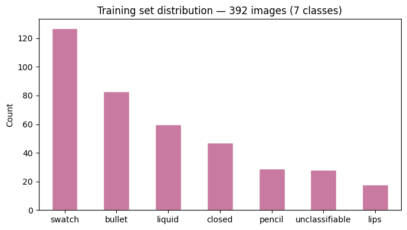
</div>

Moreover, images with visible product color are additionally *annotated with a pixel-level mask* covering the color-bearing region. These masks serve two purposes: training the segmentation models and defining the region used to derive reference color labels. For each annotated image, the mean CIELAB value is computed over the masked pixels, producing a human-supervised reference color label. This ties color extraction directly to the same annotation used for segmentation rather than a separate manual cropping workflow.

The final annotation set therefore contains presentation-type labels for all images, segmentation masks for images with visible product color, and reference CIELAB color labels derived from the annotated masks. Mean pairwise ΔE across the labeled set is 30.5, confirming broad coverage of the lipstick color space rather than concentration in a few popular shades.


>Note: The annotation set was later expanded with labels sourced through active learning. See Error Analysis → Active Learning.

### Validation & Test Set Strategy

Validation and test sets are drawn from a held-out pool: the catalog minus every image that touched training, model selection, or active learning. Because annotation is the binding constraint, sample sizes are derived rather than guessed — for each metric (per-class classifier accuracy, false-positive and false-negative rates, segmentation IoU, ΔE CIE 2000) a target margin of error and a prior variance estimate feed the standard sample-size formula (Cochran / mean-precision) with a finite-population correction, and the per-class floor is the largest requirement across metrics. The pool is sampled two ways: a *core* block drawn at random, stratified only by color group, that carries the headline numbers; and a *boost* block that tops up the rare presentation types (`lips`, `pencil`, `closed`, `unclassifiable`) using the classifier's own predictions to find candidates — reported separately, since selecting on the prediction biases that class's apparent routing recall. The test set is a temporal split: products added on or after a cutoff date, so the reported numbers measure performance on genuinely newer products. Every metric is reported with a confidence interval (Wilson for rates, Student-*t* for means). Cross-validation and independent evaluation using human assessment and multimodal-LLM judges remain ongoing work.

Validation set is also annotated in Label Studio in the same way as the training set.

---

## Stage 1: Image-Type Classifier

A fine-tuned ResNet-18 (ImageNet-pretrained) classifies each image as `bullet`, `closed`, `lips`, `liquid`, `pencil`, `swatch`, or `unclassifiable`.

<table>
  <tr>
    <td align="center" width="25%"><b>Swatch</b><br></td>
    <td align="center" width="25%"><b>Bullet</b><br></td>
    <td align="center" width="25%"><b>Liquid</b><br></td>
    <td align="center" width="25%"><b>Closed</b><br></td>
  </tr>
  <tr>
    <td align="center" width="25%"><b>Pencil</b><br>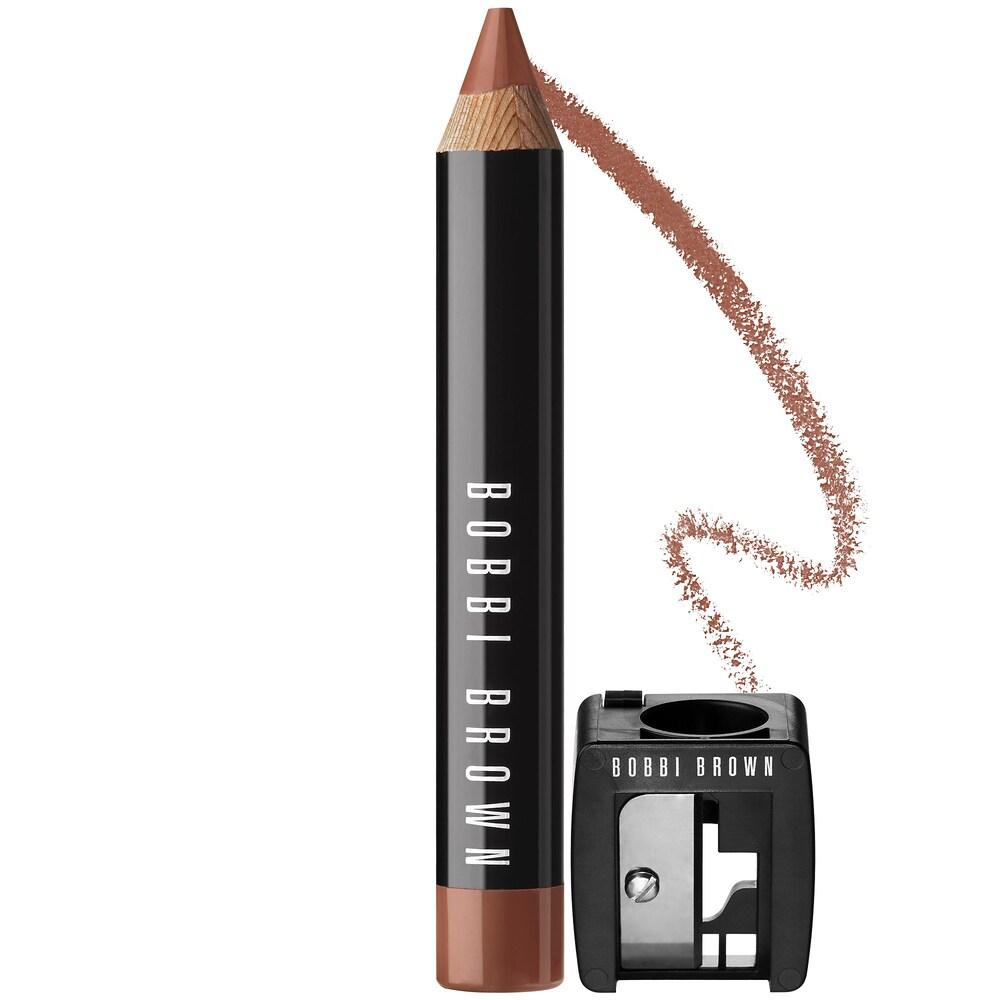</td>
    <td align="center" width="25%"><b>Lips</b><br>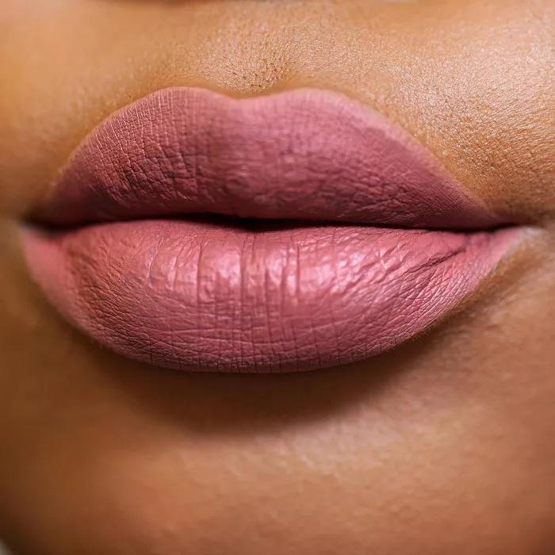</td>
    <td align="center" width="25%"><b>Unclassifiable</b><br>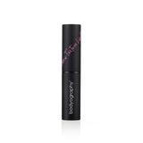</td>
    <td width="25%"></td>
  </tr>
</table>

**Why ResNet-18 + transfer learning.** The labeled set is small (~200 images), which rules out training from scratch. ResNet-18 also has several advantages:
- It's small, so it's forced to learn general features; a larger model would simply memorize 200 images and fail on unseen ones.
- The task is coarse rather than fine-grained, so ImageNet features transfer almost directly.
- It fine-tunes in minutes on a laptop GPU.

**Why two-phase fine-tuning.** The classification head is randomly initialized, so its early gradients are large and noisy. A single-phase full fine-tune would corrupt the pretrained features before the head stabilizes. So:
- Phase 1 (5 epochs, backbone frozen): the head converges against fixed pretrained features.
- Phase 2 (15 epochs, full network, lower learning rate): the backbone adapts gently to product photography.

**Why weighted cross-entropy.** Swatches outnumber the rarest classes ~3×, so an unweighted loss would let the model buy accuracy by over-predicting `swatch`. Inverse-frequency weights penalize errors on rare classes proportionally more.

**Validation accuracy: 87%** (weighted-avg F1 0.87), on the real held-out validation set (`labels_val.csv`, N=480):

| Class | Precision | Recall | F1 | Support |
|---|---|---|---|---|
| `bullet` | 0.83 | 0.99 | 0.91 | 127 |
| `closed` | 0.35 | 0.67 | 0.46 | 12 |
| `lips` | 0.79 | 1.00 | 0.88 | 11 |
| `liquid` | 0.91 | 0.92 | 0.92 | 103 |
| `pencil` | 0.90 | 0.79 | 0.84 | 24 |
| `swatch` | 0.99 | 0.88 | 0.93 | 170 |
| `unclassifiable` | 0.59 | 0.30 | 0.40 | 33 |

`closed` and `unclassifiable` are the weak spots: both are rare in training, and `unclassifiable` in particular is easy to confuse with `bullet` or `liquid` when a photo is a composite of models with the product. 

This classifier is the router for everything downstream: both extraction strategies, the production pipeline, and the active-learning loop all depend on it. Images classified `unclassifiable` exit here, because there is no color to extract.

> **Note:** Downstream error analysis later revealed that most end-to-end failures were routing errors from this stage, which is why I expanded the training set with a focus on coverage and oversampling rare categories. I also added new categories like `lips` and `pencil`.

---
## Stage 2: U-Net Segmentation + Robust Extraction

> **Why not k-means.** An earlier version of this pipeline used k-means clustering for extraction, with a **per-type optimal k** chosen by the elbow method on each predicted category. It worked well on swatches (ΔE ≈ 2.2 with the largest cluster by pixel count): the image *is* the color, so the largest cluster captures it directly. But it failed on bullet and liquid lipstick, pencils, and other container types (ΔE ≈ 16–26): packaging dominates the pixel count, so the biggest clusters are the tube and background, and no clustering variant can fix this, because clustering knows *what* colors are present but not *where* the product color is. U-Net segmentation now handles extraction for every type, including swatches.

### Color-region segmentation

Four U-Nets (ResNet-18 encoder, ImageNet-pretrained, 256×256 input → binary mask), one per class family, trained on the hand-drawn Label Studio masks. All four share the same augmentation: random horizontal/vertical flips plus rotation up to ±45°, applied identically to image and mask.

**Why U-Net + ResNet-18 encoder.** Same small-data logic as Stage 1, applied to segmentation:
- U-Net is the standard architecture for segmentation with few labels. Specifically, its skip connections carry fine spatial detail from encoder to decoder, which matters for tight masks on thin regions like a lipstick bullet.
- The ResNet-18 encoder is ImageNet-pretrained. Given the small number of annotated images, only the decoder and mask-specific behavior have to be learned from scratch.
- Reusing the same backbone as Stage 1 keeps the pipeline consistent and makes warm-starting one segmenter from another straightforward, since they all share an architecture.

- **Main segmenter** (`bullet` + `liquid` + `pencil`, 171 training images, 60 epochs): trained from ImageNet weights. Validation IoU 0.72. The `closed` and `lips` segmenters below warm-start from this one.

- **Closed segmenter** (product visible through a window or transparent packaging, 39 training images, 20 epochs): warm-started from the main segmenter's weights, since it already knows what a lipstick color-region mask looks like. Validation IoU 0.73.

- **Swatch segmenter** (123 training images, 40 epochs): trained from ImageNet weights. Warm-starting from the main segmenter was tested here too, but made no measurable difference (IoU 0.883 warm-started vs. 0.884 fresh) — a swatch photo doesn't resemble a packaged product closely enough for that prior to help, so the simpler fresh-init version was kept. Validation IoU 0.88.

- **Lips segmenter** (16 training images, deduplicated from 18 — a few rows share one retailer photo across shade listings — 30 epochs): warm-started from the main segmenter. Validation IoU 0.84.

See randomly selected image-mask-prediction combinations:

<table>
  <tr>
    <td></td>
    <td></td>
  </tr>
</table>


### Color extraction from the masked region

After identifying the area of the image that has the color we need, we have to extract it. 

I compared five extraction strategies (mean, median, dominant cluster, and others) on the same masked pixels, scored by ΔE with respect to the ground truth (out of sample). 

Median ΔE is at or near the just-noticeable-difference threshold (~2) for every product type, so that was the method used.


---
## Error Analysis → Active Learning

I conducted end-to-end error analysis from classification, to segmentation and color prediction. This surfaced a recurring **Stage 1 routing error**: windowed-container images misclassified as `bullet` or `liquid`, sent through the wrong segmenter, producing nonsense colors.

I closed the loop with active learning, run across two rounds: score classifier confidence on images outside the training set, flag the low-confidence cases (largely the `closed`/`bullet`/`liquid` confusion above), correct just the type label, and retrain. The first round added 48 corrected images to the training set; the second, 13.

The training set was later expanded further for coverage and to oversample rare categories (adding `lips` and `pencil`, among other gaps).

---

## End to end Evaluation 

Stage 1 classifies each image, then routes it to its type's U-Net segmenter, followed by median LAB extraction from the masked pixels:

- `bullet`, `liquid`, `pencil` → main segmenter + median LAB
- `closed` → closed segmenter + dominant-cluster LAB (resists glare/reflection through transparent packaging)
- `swatch` → swatch segmenter + median LAB
- `lips` → lips segmenter + median LAB
- `unclassifiable` → no extraction

End-to-end ΔE against ground truth, on the real held-out validation set (predicted-routed, i.e. using the classifier's own routing decision rather than the true label):

| Type | n | Mean ΔE | Median ΔE |
|---|---|---|---|
| swatch | 150 | 0.42 | 0.07 |
| bullet | 123 | 0.75 | 0.45 |
| lips | 12 | 1.96 | 0.46 |
| liquid | 95 | 2.05 | 0.65 |
| pencil | 20 | 3.65 | 0.75 |
| closed | 12 | 1.92 | 0.44 |
| **All (core)** | 320 | 1.06 | 0.29 |

Every type's median ΔE lands well under the ~2.3 just-noticeable-difference threshold. The median is a more representative number here, since Mean ΔE is skewed upward by a handful of outlier images in the smaller samples (e.g. `pencil`'s mean of 3.65 vs. its median of 0.75). `pencil`, `closed`, and `lips` have the smallest validation samples (n=20, n=12, n=12) and the widest mean/median gaps; all three are rare classes with fewer training and validation examples than swatch/bullet/liquid, so a few bad routings or masks pull their mean disproportionately.

Randomly selected examples showing predicted vs. ground-truth color:

<table>
  <tr>
    <td width="33%" align="center"><b>Swatch</b><br>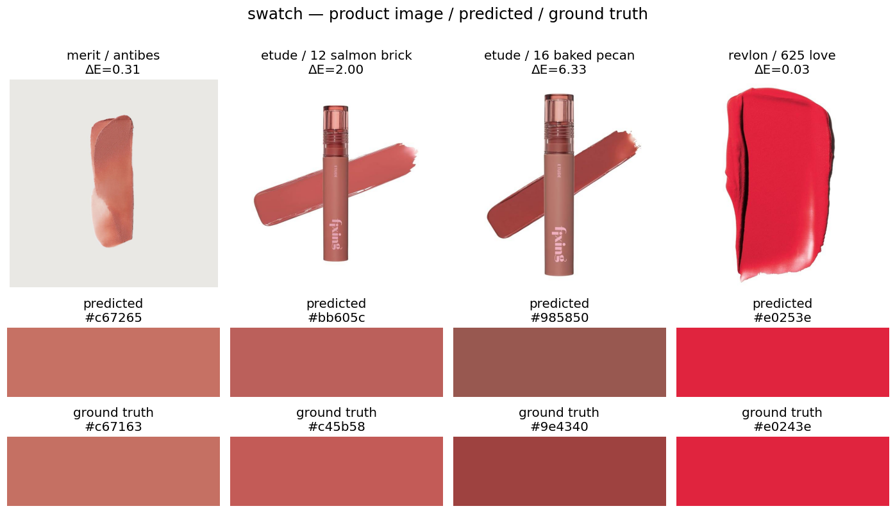</td>
    <td width="33%" align="center"><b>Bullet</b><br>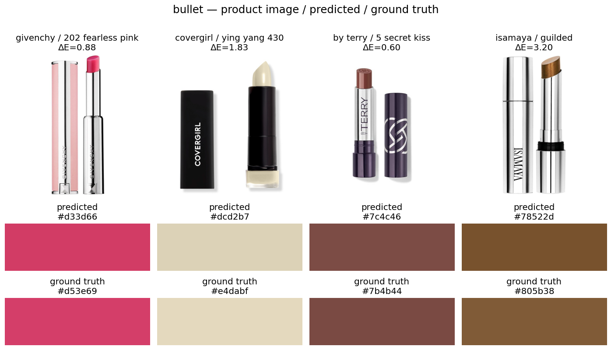</td>
    <td width="33%" align="center"><b>Liquid</b><br>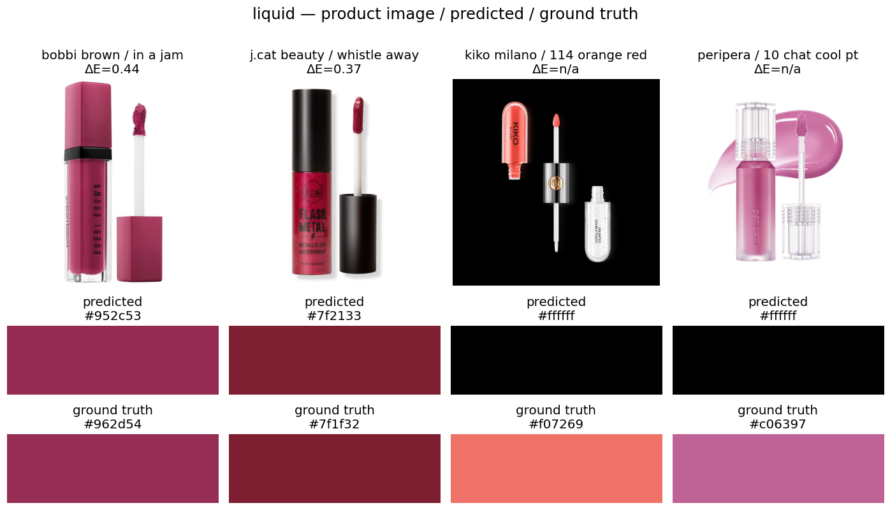</td>
  </tr>
  <tr>
    <td width="33%" align="center"><b>Pencil</b><br>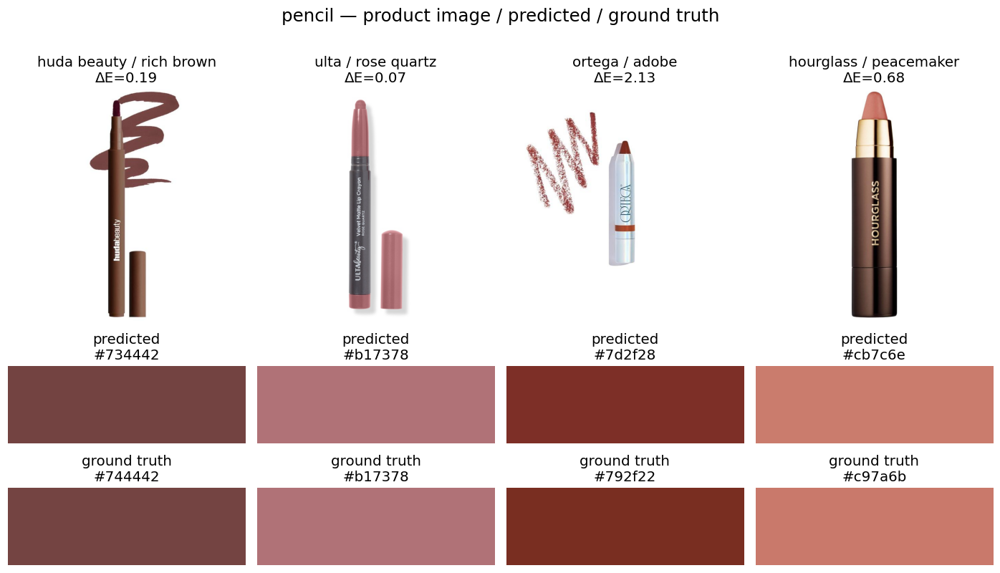</td>
    <td width="33%" align="center"><b>Closed</b><br>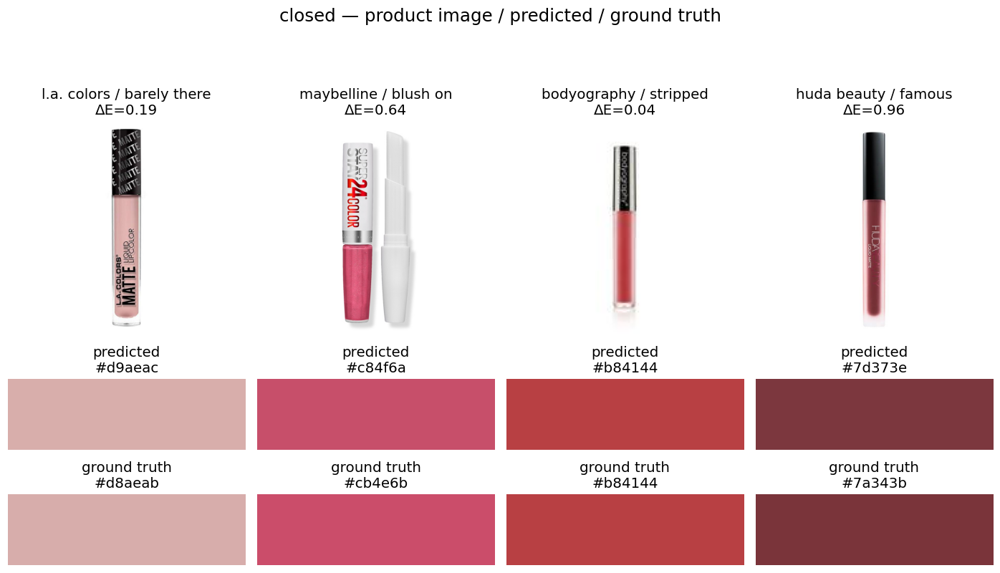</td>
    <td width="33%" align="center"><b>Lips</b><br>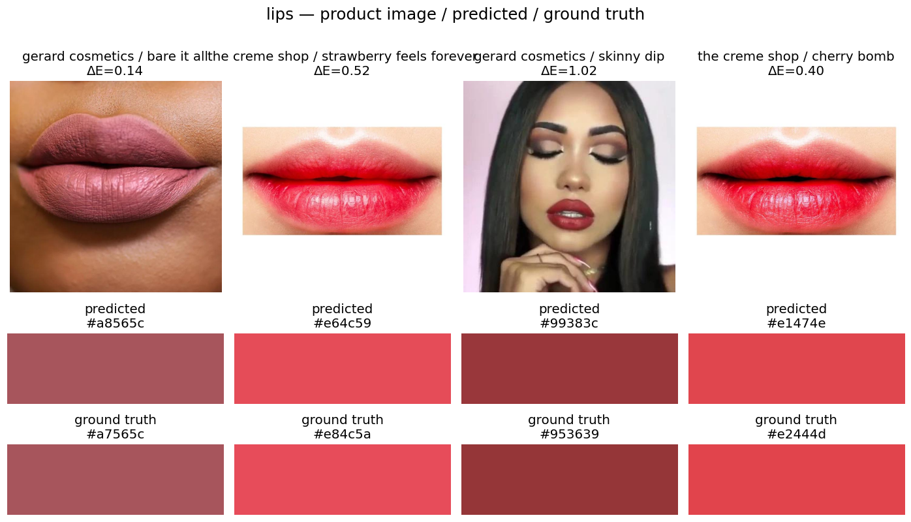</td>
  </tr>
</table>

---

## Production Run & Color Index

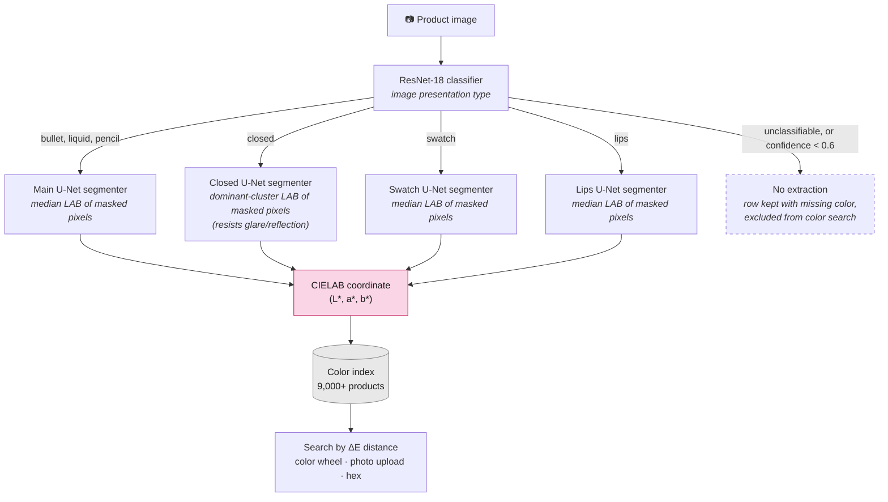

The hybrid pipeline runs over the full catalog of **9,167 product images** with batched ResNet-18 inference for routing, then type-specific extraction:

- Almost every image routed to a color-bearing class produces a color; a small number come back with an empty predicted mask (no pixels above the 0.5 threshold) and are left with a missing color rather than a guessed one.

- Images classified `unclassifiable`, or below the classifier's `CLF_THRESHOLD` confidence safety net, are **explicitly declined**. 

- Output: a CIELAB coordinate (plus hex) for every indexed product, joined back to brand/product/shade metadata.

Randomly sampled products from the full production run, by routed type, with the extracted color swatch below each:

<table>
  <tr>
    <td align="center" width="33%"><b>Swatch</b><br>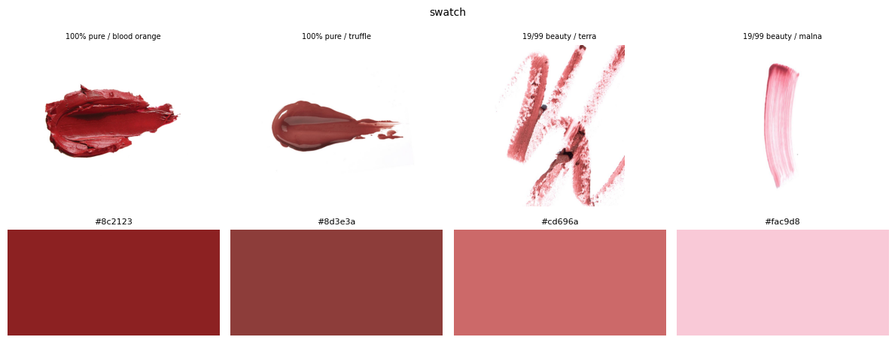</td>
    <td align="center" width="33%"><b>Bullet</b><br>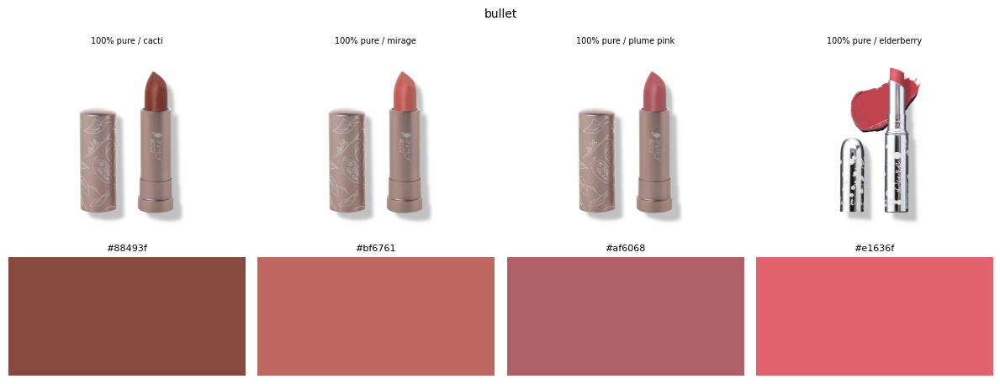</td>
    <td align="center" width="33%"><b>Liquid</b><br>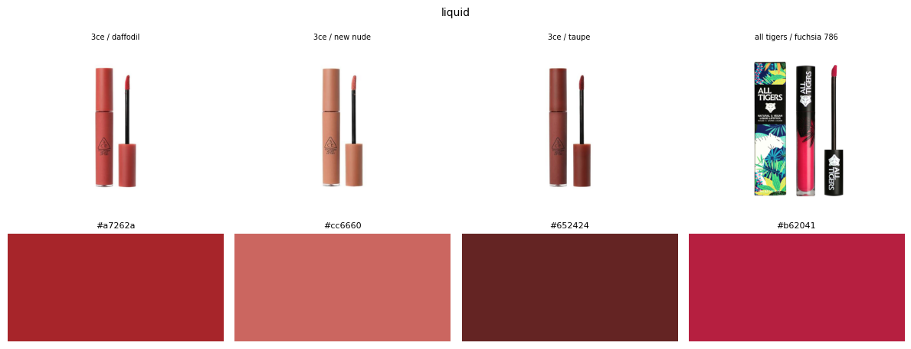</td>
  </tr>
  <tr>
    <td align="center" width="33%"><b>Pencil</b><br>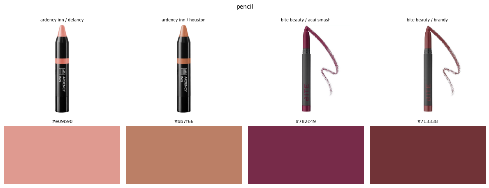</td>
    <td align="center" width="33%"><b>Closed</b><br>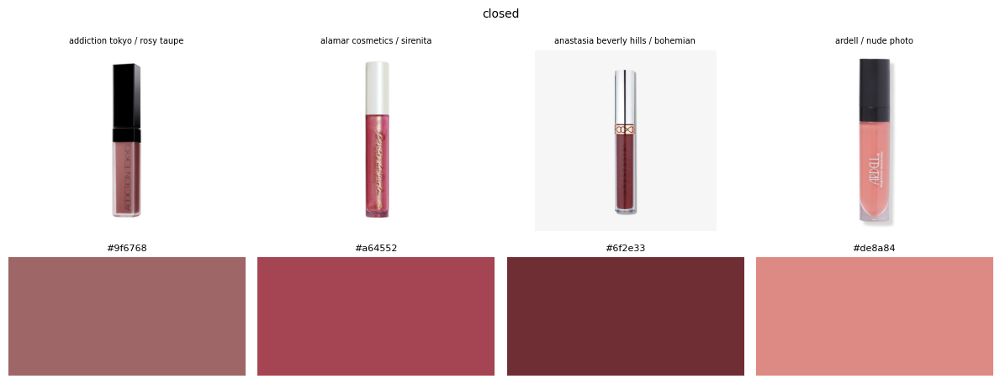</td>
    <td align="center" width="33%"><b>Lips</b><br>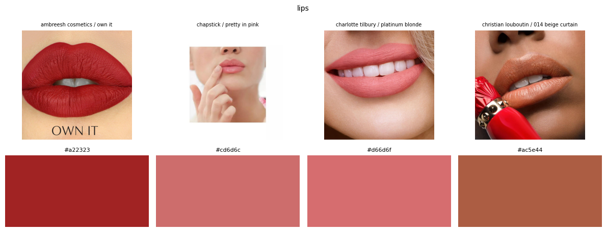</td>
  </tr>
</table>

For the app's color-wheel navigation, the full catalog is clustered in LAB space with a **Gaussian Mixture Model**, with the number of components selected by **BIC**. GMM was chosen over k-means deliberately: its full-covariance ellipsoidal clusters fit the highly uneven shape of the lipstick color distribution. Particularly, the dense nude/pink/red region next to sparse purples and browns would have been over-split with k-means' spherical clusters. Queries (color wheel, photo upload, or hex) return products ranked by ΔE distance to the query color.

---

## Learnings

**Localization beats color statistics.** Clustering methods know *what* colors are in an image but not *where* the product is. The single biggest accuracy jump in the project came from segmenting the right pixels first.

**Warm-starting helps only when the source and target domains actually look alike.** Warm-starting the `closed` (39 training images) and `lips` (16 images) segmenters from the main segmenter's weights, instead of training from ImageNet weights alone, was the difference between usable and unusable masks on those rare classes. But it's not automatic: testing the same warm start on the `swatch` segmenter made no measurable difference (IoU 0.883 vs. 0.884 fresh); swatch photo doesn't resemble the packaged-product images the main segmenter learned from, so that prior had nothing to transfer.

**Active learning pays off most when annotation is the bottleneck.** Hand-drawing segmentation masks and cropping ground-truth colors is slow, so annotating images is expensive relative to what each label teaches the model. Letting the classifier's own uncertainty choose what to annotate next inverted that: low-confidence predictions pointed straight at the failure mode (windowed-container images split between `closed` and `bullet`/`liquid`), and fixing them required only cheap type-label corrections — no new masks. Forty-eight targeted labels improved generalization on exactly the category the pipeline was misrouting, a result random sampling would have needed far more annotation time to match.

**Evaluation is only as good as the ground truth you design.** Because no benchmark existed, every modeling claim in this project rests on the stratified, hand-labeled CIELAB sample built first. I'm currently working on expanding evaluation using Multimodal LLMs-as-a-jude because a [previous analysis](https://github.com/ConstanzaSchibber/capstone_colors#method-2-improving-makeup-color-identification-with-multimodal-ai) I did showed that they can identify specific CIELAB colors.

## Citation

If you use this project in your research, please cite:

```bibtex
@misc{schibber2024lipstick,
  author       = {Schibber, Constanza},
  title        = {Lipstick Color Finder: ML-Powered Color Search Across 9,000+ Products},
  year         = {2024},
  publisher    = {GitHub},
  url          = {https://github.com/ConstanzaSchibber/lipstick_color_extraction},
  note         = {Licensed under CC BY-NC 4.0}
}
```
