# Lipstick Color Finder: ML-Powered Color Search Across 9,000+ Products

**tl;dr:**

- **Goal:** Identify the color of lipstick products in CIELAB color space to enable comparison by standardized shade rather than by the creative names brands assign.

- **Data:** 9,000+ product images and metadata collected from makeup retailers via API and web scraping; hand-labeled CIELAB ground truth built from a stratified sample for training and evaluation.

- **Methods:** A hybrid two-stage pipeline: a fine-tuned ResNet-18 classifies each image by presentation type (swatch, bullet, liquid, closed, color not shown), which routes it to the best extraction strategy: k-means for swatches, U-Net segmentation + median LAB for product shots, and an explicit no-extraction branch when no color is visible. Evaluated against ground truth with Delta E CIE 2000 (median ΔE ≈ 1–2.4 per type, at the threshold of human perception); a Gaussian Mixture Model clusters the catalog for color-based browsing.

- **App:** Web interface for searching 9,000+ lip products by color: color wheel, photo upload, or hex input.

- **Tech stack:** Python, PyTorch, Jupyter, OpenCV, scikit-learn, Label Studio.

---

> **Just want to see the app?** Try it at [lipstickbycolor.github.io](https://lipstickbycolor.github.io/). Source code at [github.com/LipstickByColor](https://github.com/LipstickByColor).

> **Just want to read a high-level overview?** [About](https://lipstickbycolor.github.io/about.html).

---

*Table of Contents*
- [Overview: Problem and Solution](#overview-problem-and-solution)
- [Methods Overview](#methods-overview)
- [Human Annotation & Ground Truth](#human-annotation--ground-truth)
- [Stage 1: Product-Type Classifier](#stage-1-product-type-classifier)
- [Stage 2, Strategy 1: K-Means Clustering](#stage-2-strategy-1-k-means-clustering)
- [Stage 2, Strategy 2: U-Net Segmentation + Robust Extraction](#stage-2-strategy-2-u-net-segmentation--robust-extraction)
- [Error Analysis → Active Learning](#error-analysis--active-learning)
- [Evaluation: Clustering vs. Segmentation](#evaluation-clustering-vs-segmentation)
- [Production Run & Color Index](#production-run--color-index)
- [Learnings](#learnings)
- [Citation](#citation)

## Overview: Problem and Solution

Lipsticks come in every color and shade imaginable, but finding a specific color or shade online is surprisingly difficult.

<table border="0" cellspacing="0" cellpadding="0">
  <tr>
    <td width="60%" valign="top" style="border: none;">First, brand naming is inconsistent and opaque. Brands use evocative names like "Velvet Plum," "Midnight Berry," and "Spiced Rosewood" that don't map to a specific color. Even when a color appears in the name, it isn't consistent across or within brands. All of the shades to the right, for instance, are called "mauve" by different brands.</td>
    <td width="40%" align="center" style="border: none;"></td>
  </tr>
</table>

Second, retailer search and filtering tools are inadequate. Filtering by "Pink" returns hundreds of results spanning wildly different shades such as the ones below.

<table>
  <tr>
    <td align="center" width="25%"><b>Amazon</b><br></td>
    <td align="center" width="25%"><b>Google Shopping</b><br></td>
    <td align="center" width="25%"><b>Sephora</b><br></td>
    <td align="center" width="25%"><b>Ulta</b><br></td>
  </tr>
</table>

Some retailers like Sephora and Ulta offer limited color filters, most likely based on metadata supplied by brands, that collapse the entire spectrum into a handful of broad buckets. Others, like Amazon and Google Shopping, offer no color filters at all, forcing users to search by name. While "pink" or "red" might feel obvious, shades like mauve, dusty rose, or terracotta are ambiguous. And there's no guarantee the search engine returns useful results.

<div align="center">
<table>
  <tr>
    <td align="center"><b>Sephora</b><br>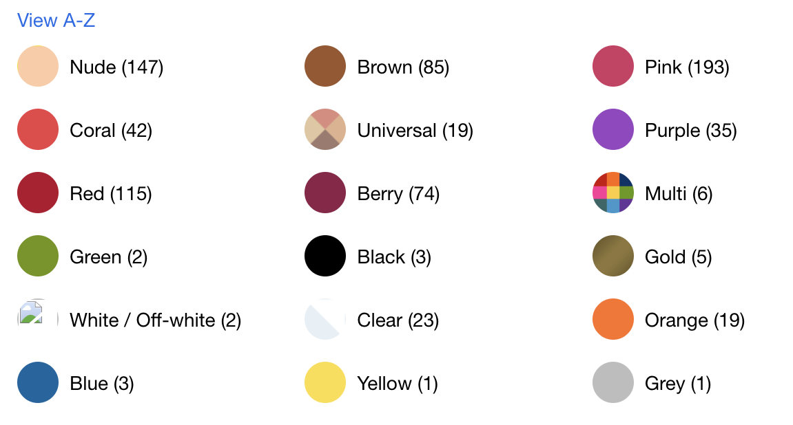</td>
    <td align="center"><b>Ulta</b><br>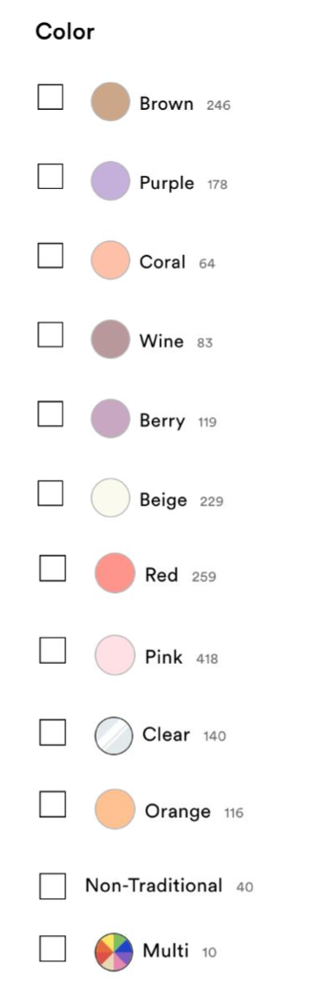</td>
  </tr>
</table>
</div>

Given these limitations, it's not only hard to discover and search for lipsticks, but comparing shades across brands or finding a cheaper alternative to a known favorite is very time consuming.

### Web App

By mapping lipstick colors to the [CIELAB color space](https://lipstickbycolor.github.io/color-guide.html), I create a standardized, perceptually uniform representation that enables accurate shade comparison across brands. CIELAB represents color in three dimensions: L (lightness), a (green to red), and b (blue to yellow). Equal numerical differences in CIELAB correspond to roughly equal perceived differences to the human eye. This is the same standard cosmetics manufacturers use internally for color quality control, and it makes the matching problem measurable: the distance between two colors (Delta E) directly quantifies how different they look.

The app allows for multiple ways to search for lip products by color: **Search by color wheel**, **Search by photo**, **Search by hex.** Products can be saved to a **wishlist** for easy comparison across shades and brands, and as a starting point of future searches. Results are ranked by Delta E. 

Below are some illustrations from the app:

<table>
  <tr>
    <td width="33%" align="center"><b>Color wheel, pick a color</b></td>
    <td width="33%" align="center"><b>Zoom into a selected color</b></td>
    <td width="33%" align="center"><b>Photo upload and select color</b></td>
  </tr>
  <tr>
    <td width="33%"></td>
    <td width="33%"></td>
    <td width="33%"></td>
  </tr>
  <tr>
    <td width="33%"></td>
    <td width="33%"></td>
    <td width="33%"></td>
  </tr>
</table>

> **Test the app ** [lipstickbycolor.github.io](https://lipstickbycolor.github.io/).  

---

## Methods Overview

The core challenge, given a raw retailer product image, is to recover the true lipstick color as a CIELAB coordinate. The difficulty is that the lipstick color is usually a *small region* of the image — a bullet tip, a doe-foot applicator, a smear visible through transparent packaging — surrounded by packaging, backgrounds, and shadows that dominate the pixel count.

The right way to extract color depends on what kind of image you're looking at. A swatch *is* the color; a bullet shot is mostly tube; a windowed container shows the color only through plastic. So the architecture is two stages:

1. **Stage 1 — Classify:** a fine-tuned ResNet-18 identifies each image's presentation type (`swatch`, `bullet_lipstick`, `liquid_lipstick`, `closed`, `color_not_shown`).

2. **Stage 2 — Extract:** the predicted type routes the image to a type-appropriate color extraction strategy.

For Stage 2, I built and evaluated two candidate extraction strategies head-to-head on every image type:

| | Strategy | Idea |
|---|---|---|
| **Clustering** | K-means on the image's pixels, with a per-type optimal k | The product color should emerge as a dominant color cluster |
| **Segmentation** | U-Net isolates the color region, then a robust statistic extracts from those pixels | Find *where* the color is first, then measure it |

Both are scored against human-annotated ground truth using **Delta E CIE 2000 (ΔE)** — the perceptual color-difference metric where values under ~2 are imperceptible to the human eye. The comparison produced a clear, actionable result: **each strategy wins on different image types, and production routes each type to its winner.**

---

## Human Annotation & Ground Truth

No benchmark dataset exists for "the true color of this lipstick product image," so I designed one. 

**Sampling.** To size the sample, I used Cochran's formula with the CIELAB L* standard deviation from a prior analysis I did as the variance estimate. But I also wanted the sample to span the full color range rather than over-indexing on common shades, which meant stratifying by color. That required usable color labels, so I consolidated the 200+ inconsistent `parent_color` values from the raw retailer metadata into 18 color groups using a keyword-based, [LLM-assisted taxonomy](notebooks/03_annotation_sampling.ipynb). I then drew with stratified proportional sampling, adding a minimum floor of 5 images per group so rare shades like deep purples and true oranges wouldn't get skipped, bringing the final count to 222 images.

**Labeling.** For each sampled image I manually cropped the region showing the true product color and extracted the mean CIELAB value as the ground-truth label (209 of 222 images were croppable). Mean pairwise ΔE across the labeled sample is 30.5, confirming the ground truth spans the color space rather than clustering in a few popular shades. See below the ground truth swatches across parent color taxonomy.

<div align="center">
  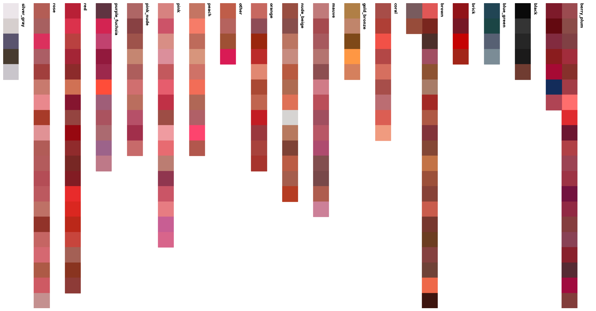
</div>


**Image annotation.** I built this annotation in Label Studio to train the project's PyTorch classification and segmentation models. For the classifier, I labeled each image's presentation type into five classes: `swatch`, `bullet`, `liquid`, `closed` (containers where the product color is visible through a window or transparent packaging), and `color_not_shown` (fully closed packaging with no recoverable color). For the segmenters, I hand-drew masks over the color region. All five types are kept as first-class classifier labels. This includes `color_not_shown` so that the production pipeline can decline extraction instead of returning an incorrect color. Both label types were produced together in one annotation pass. The annotated set is the ground-truth sample above, expanded by an active learning step that surfaced additional images worth labeling.

---

## Stage 1: Image-Type Classifier

A fine-tuned ResNet-18 (ImageNet-pretrained) classifies each image as `swatch`, `bullet_lipstick`, `liquid_lipstick`, `closed`, or `color_not_shown`.

<table>
  <tr>
    <td align="center" width="20%"><b>Swatch</b><br>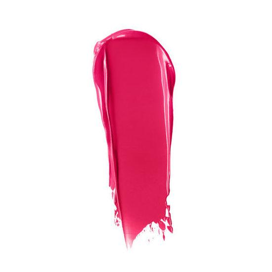</td>
    <td align="center" width="20%"><b>Bullet</b><br>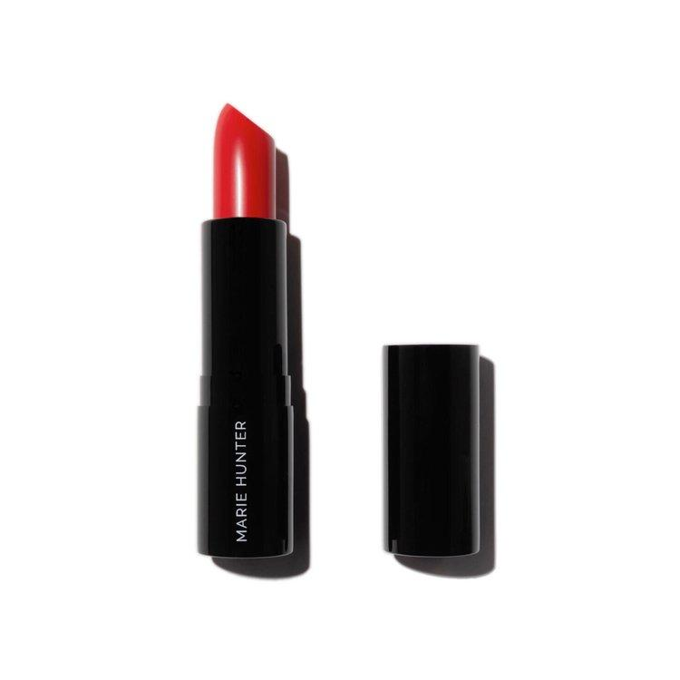</td>
    <td align="center" width="20%"><b>Liquid</b><br>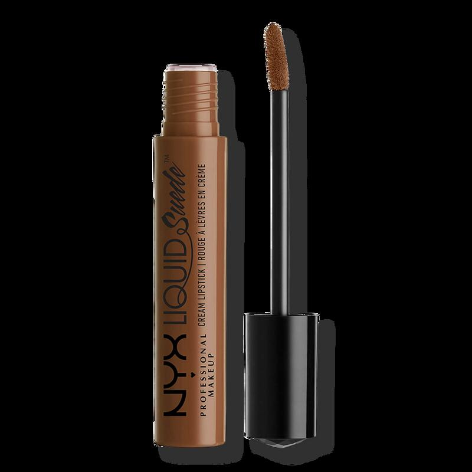</td>
    <td align="center" width="20%"><b>Closed</b><br>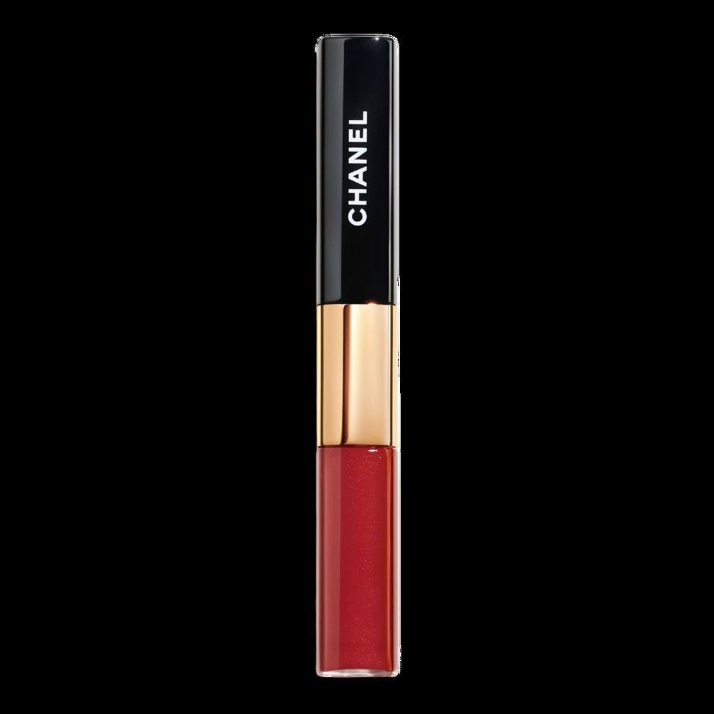</td>
    <td align="center" width="20%"><b>Color Not Shown</b><br>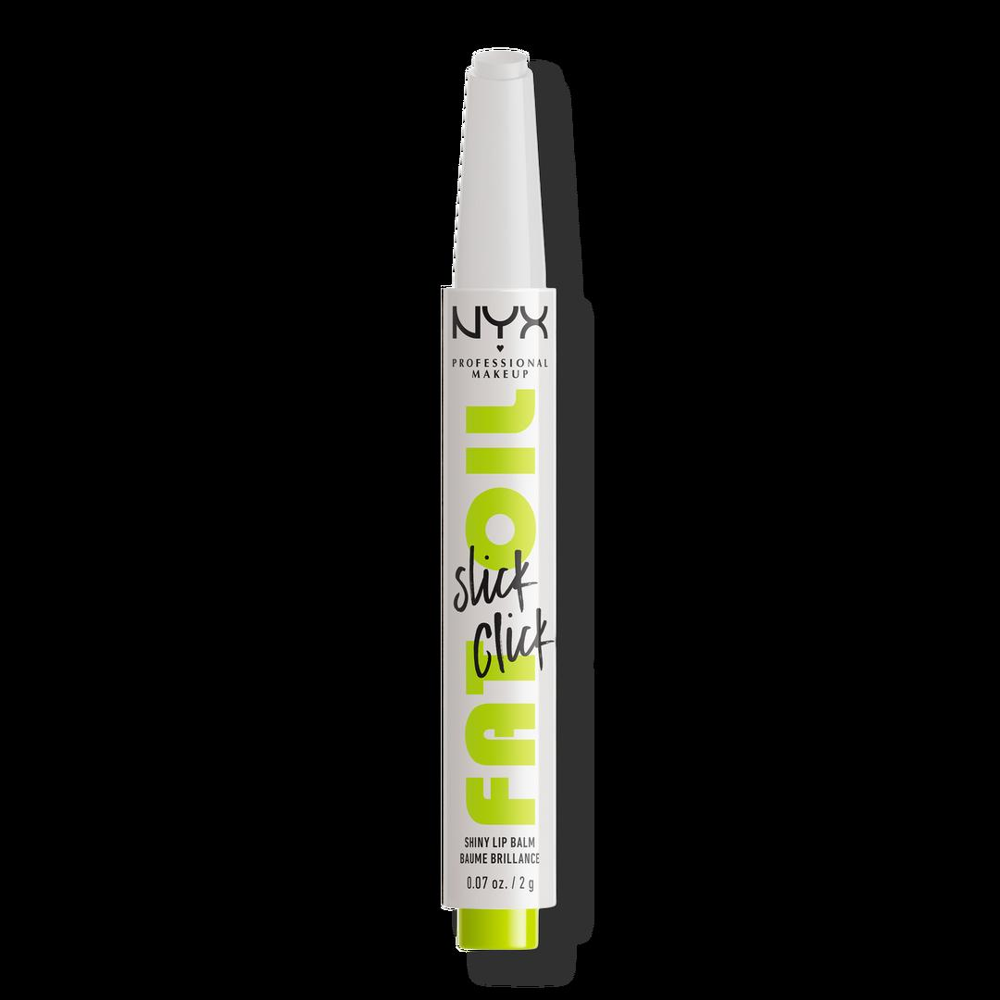</td>
  </tr>
</table>

<div align="center">
  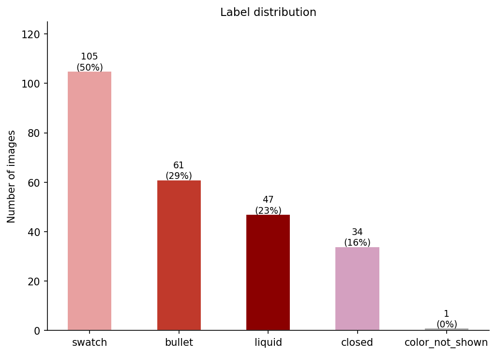
</div>

**Why ResNet-18 + transfer learning.** The labeled set is small (~200 images), which rules out training from scratch. ResNet-18 also has several advantages:
- It's small, so it's forced to learn general features; a larger model would simply memorize 200 images and fail on unseen ones.
- The task is coarse rather than fine-grained, so ImageNet features transfer almost directly.
- It fine-tunes in minutes on a laptop GPU.

**Why two-phase fine-tuning.** The classification head is randomly initialized, so its early gradients are large and noisy. A single-phase full fine-tune would corrupt the pretrained features before the head stabilizes. So:
- Phase 1 (5 epochs, backbone frozen): the head converges against fixed pretrained features.
- Phase 2 (15 epochs, full network, lower learning rate): the backbone adapts gently to product photography.

**Why weighted cross-entropy.** Swatches outnumber the rarest classes ~3×, so an unweighted loss would let the model buy accuracy by over-predicting `swatch`. Inverse-frequency weights penalize errors on rare classes proportionally more.

**Validation accuracy: 97%.**

This classifier is the router for everything downstream: both extraction strategies, the production pipeline, and the active-learning loop all depend on it. Images classified `color_not_shown` exit here, because there is no color to extract.

> **Note:** The 97% figure is the first-pass classifier. Downstream error analysis later revealed that most end-to-end failures were routing errors from this stage, which an active-learning iteration fixed. See [Error Analysis → Active Learning](#error-analysis--active-learning). Final validation accuracy: 98%.


---
## Stage 2, Strategy 1: K-Means Clustering

The product color should be a dominant color cluster in the image. A single global k underperforms because a swatch, a bullet, and a tube have fundamentally different visual structure, so k-means runs with a **per-type optimal k** chosen by the elbow method on each predicted category. Two variants are compared per type: *peak* (largest cluster by pixel count) and *mean* (average across non-background clusters), with near-black and near-white clusters filtered as packaging/background noise.

**Results (ΔE vs. ground truth):**

- **Swatch works (ΔE ≈ 2.2 with peak):** the image *is* the color, so the largest cluster captures it directly.

- **Bullet / liquid fail (ΔE ≈ 16–26):** packaging dominates the pixel count, so the biggest clusters are the tube and background. No clustering variant can fix this, because clustering knows *what* colors are present but not *where* the product color is.


---

## Stage 2, Strategy 2: U-Net Segmentation + Robust Extraction

### Color-region segmentation

Two U-Nets (ResNet-18 encoder, ImageNet-pretrained, 256×256 input → binary mask) trained on the hand-drawn Label Studio masks.

**Why U-Net + ResNet-18 encoder.** Same small-data logic as Stage 1, applied to segmentation:
- U-Net is the standard architecture for segmentation with few labels. Specifically, it skip connections carry fine spatial detail from encoder to decoder, which matters for tight masks on thin regions like a lipstick bullet.
- The ResNet-18 encoder is ImageNet-pretrained. Given the small number of annotated images, only the decoder and mask-specific behavior have to be learned from scratch.
- Reusing the same backbone as Stage 1 keeps the pipeline consistent and made the Segmenter A → Segmenter B warm-start straightforward, since both share an architecture.

The two U-Nets trained on the hand-drawn Label Studio masks:

Two U-Nets (ResNet-18 encoder, ImageNet-pretrained, 256×256 input → binary mask) trained on the hand-drawn Label Studio masks:

- **Segmenter A** (`bullet` + `liquid`, 74 training images): 20 epochs at a fixed LR, evaluated with IoU. A longer `ReduceLROnPlateau` run *reduced* validation IoU (because the bottleneck is dataset size) so the simpler run was kept.

- **Segmenter B** (`closed` — product visible through a window or transparent packaging, ~27 training images): training from ImageNet weights produced loose masks. Two fixes: warm-starting from Segmenter A's weights, since it already knows what a lipstick color-region mask looks like, and synchronized augmentation (identical flips and ±15° rotations applied to image and mask). With these, predicted masks align tightly with ground truth.

See randomly selected image-mask-prediction combinations:

<table>
  <tr>
    <td>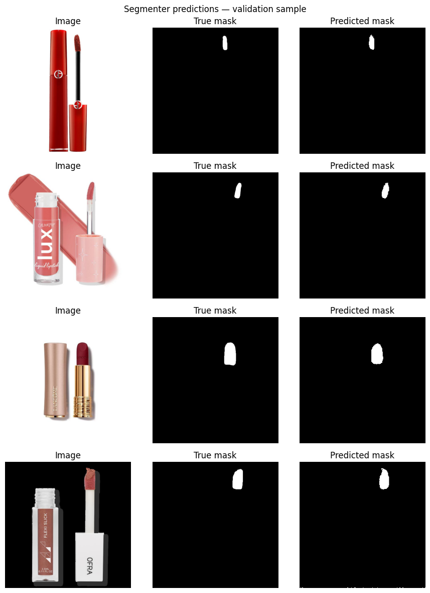</td>
    <td>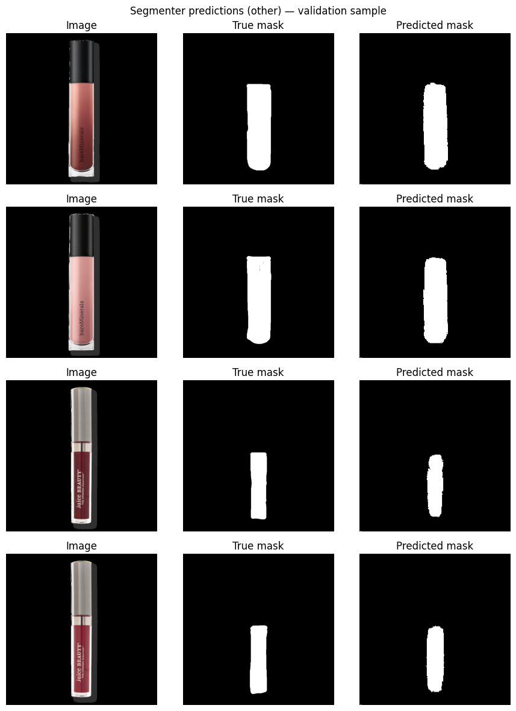</td>
  </tr>
</table>


### Color extraction from the masked region

After identifying the area of the image that has the color we need, we have to extract it. 

I compared five extraction strategies (mean, median, dominant cluster, and others) on the same masked pixels, scored by ΔE with respect to the ground truth (out of sample). 

Median ΔE is at or near the just-noticeable-difference threshold (~2) for every product type, so that was the method used.


---
## Error Analysis → Active Learning

The results detailed above included an iteration of active learning.

Inspecting the 12 highest-ΔE cases (image + mask overlay + predicted-vs-truth swatches side by side) revealed a consistent pattern: the failures weren't segmentation or extraction errors — they were **Stage 1 routing errors**. Windowed-container images misclassified as `bullet` or `liquid` get sent through the wrong segmenter and produce nonsense colors.

I closed the loop with a lightweight active-learning cycle:

1. **Surface:** score classifier confidence on images outside the training set; low-confidence predictions (typically split between `bullet`/`liquid` and `closed`) flag the failure mode. 

2. **Correct:** export those images as an annotation queue, review, and fix only the type label. New masks were not required.

3. **Retrain:** merge 48 corrected images (mostly `closed`) into the training set, recompute class weights, retrain Stage 1.

Accuracy on the original validation images was already near-ceiling, so the gain shows up where it matters: **generalization to unseen windowed-container images** which is the exact category the production pipeline was misrouting. Expanded validation accuracy: 98%.

---

## Evaluation & Production Routing: Clustering vs. Segmentation

Stage 1 classifies each image, then routes it to the cheapest extraction method that wins for its type:

- `swatch` → k-means peak color
- `bullet`, `liquid` → U-Net Segmenter A + median
- `closed` → U-Net Segmenter B + dominant cluster
- `color_not_shown` → no extraction

Swatches are entirely the target color, so k-means is accurate on its own. No masks or segmentation model needed for the largest image category (~30%). For everything else the color is a small region surrounded by packaging, where k-means fails badly but segmentation gets close to the just-noticeable-difference threshold:

| Image type | k-means | Alternative | Production choice |
|---|---|---|---|
| swatch | **2.16** | 3.15 (threshold + median) | k-means |
| bullet / liquid / closed | 16–26 | **2–4.6** (U-Net) | Segmentation |

*Mean ΔE vs ground truth on the same labeled images; bold = method used in production.*

Randomly selected examples showing predictions from clustering (A pred, left) and segmentation (C pred, right) against ground truth (bottom):

<table>
  <tr>
    <td width="50%" align="center"><b>Swatch</b><br>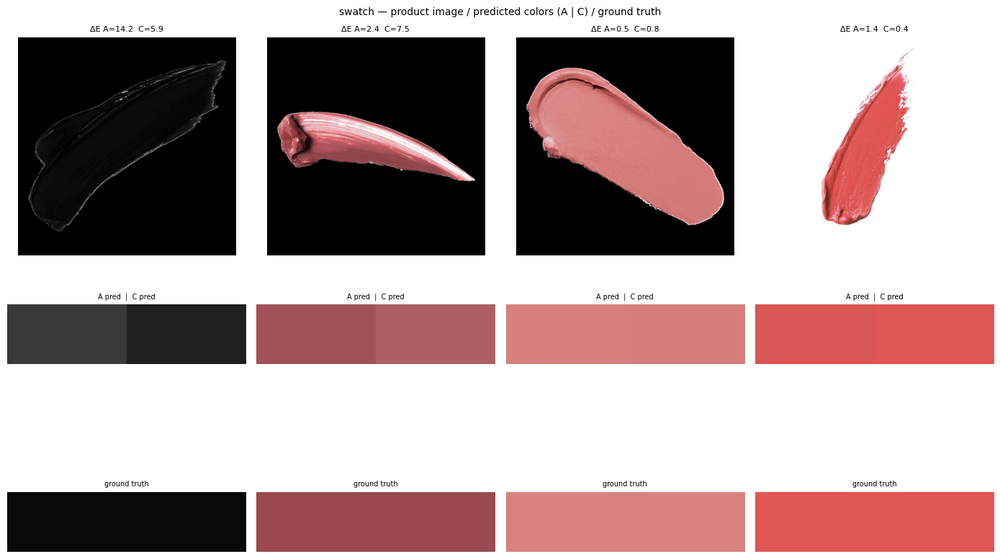</td>
    <td width="50%" align="center"><b>Bullet</b><br>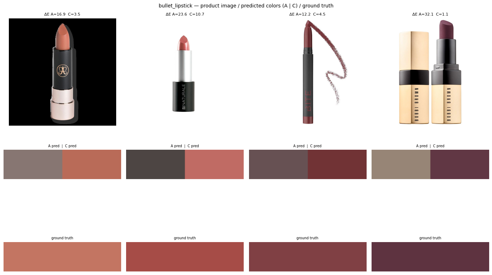</td>
  </tr>
  <tr>
    <td width="50%" align="center"><b>Liquid</b><br>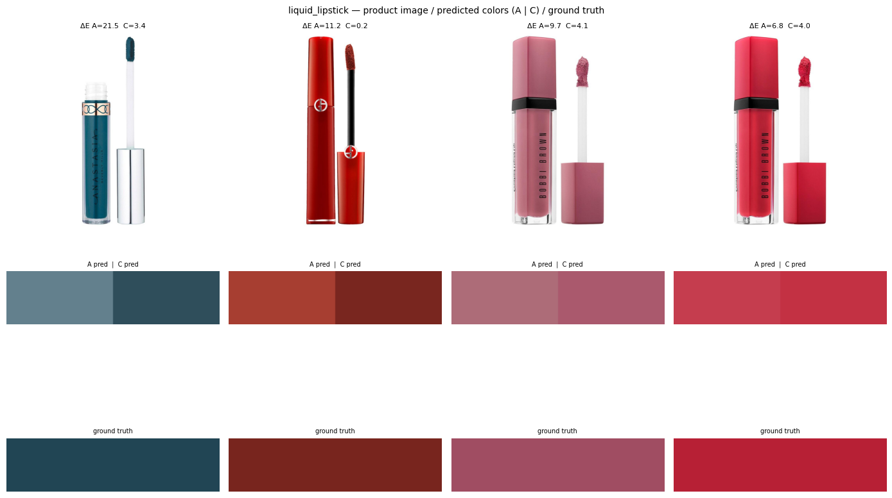</td>
    <td width="50%" align="center"><b>Closed</b><br>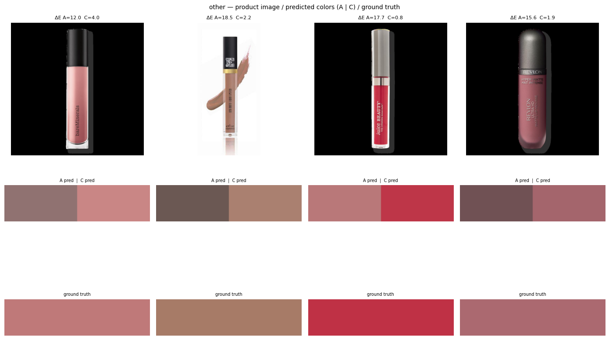</td>
  </tr>
</table>

---

## Production Run & Color Index

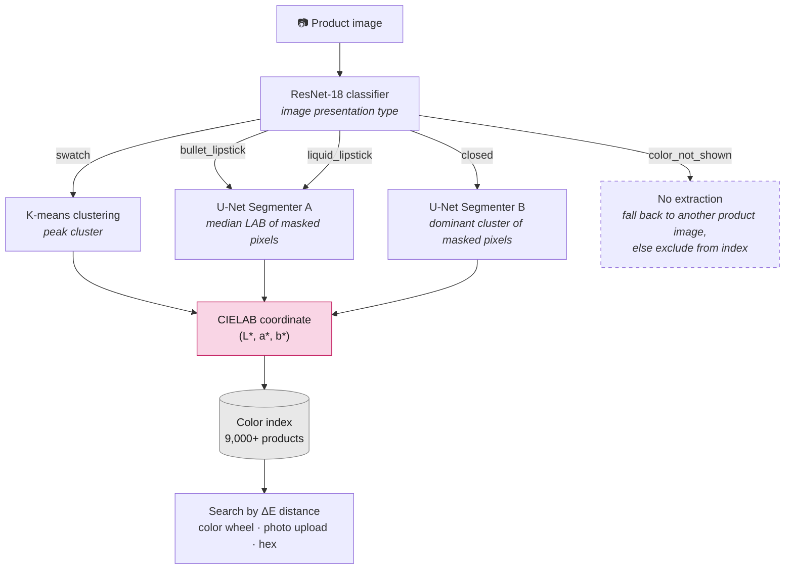

The hybrid pipeline runs over the full catalog of **9,167 product images** with batched ResNet-18 inference for routing, then type-specific extraction:

- Every image routed to a color-bearing class produces a color. Robustness comes from a small fallback: if a U-Net mask is empty at threshold 0.5, the pipeline retries at 0.3 rather than dropping the product.

- Images classified `color_not_shown` are **explicitly declined**. 

- Output: a CIELAB coordinate (plus hex) for every indexed product, joined back to brand/product/shade metadata.

For the app's color-wheel navigation, the full catalog is clustered in LAB space with a **Gaussian Mixture Model**, with the number of components selected by **BIC**. GMM was chosen over k-means deliberately: its full-covariance ellipsoidal clusters fit the highly uneven shape of the lipstick color distribution. Particularly, the dense nude/pink/red region next to sparse purples and browns would have been over-split with k-means' spherical clusters. Queries (color wheel, photo upload, or hex) return products ranked by ΔE distance to the query color.

---

## Learnings

**Localization beats color statistics.** Clustering methods know *what* colors are in an image but not *where* the product is. The single biggest accuracy jump in the project (ΔE 16–26 → ~2) came not from a better color algorithm but from segmenting the right pixels first.

**With small data, transfer what you have before training longer.** Warm-starting the `closed` segmenter from the bullet/liquid segmenter's weights (~27 training images) helped far more than any optimization tweak, while adding an LR scheduler and more epochs to the main segmenter actually *hurt* validation IoU. When the bottleneck is data, the answer is better priors and augmentation, not longer training.

**Active learning pays off most when annotation is the bottleneck.** Hand-drawing segmentation masks and cropping ground-truth colors is slow, so annotating images is expensive relative to what each label teaches the model. Letting the classifier's own uncertainty choose what to annotate next inverted that: low-confidence predictions pointed straight at the failure mode (windowed-container images split between `closed` and `bullet`/`liquid`), and fixing them required only cheap type-label corrections — no new masks. Forty-eight targeted labels improved generalization on exactly the category the pipeline was misrouting, a result random sampling would have needed far more annotation time to match.

**The simplest method that wins should ship.** The deep pipeline lost to plain k-means on *swatch images*. Keeping k-means for that route made the production system both cheaper and more accurate than committing to deep learning everywhere. Swatches are the most common image at around 30%.

**Evaluation is only as good as the ground truth you design.** Because no benchmark existed, every modeling claim in this project rests on the stratified, hand-labeled CIELAB sample built first. I'm currently working on expanding evaluation using Multimodal LLMs-as-a-jude because a [previous analysis](https://github.com/ConstanzaSchibber/capstone_colors#method-2-improving-makeup-color-identification-with-multimodal-ai) I did showed that they can identify specific CIELAB colors.

## Citation

If you use this project in your research, please cite:

```bibtex
@misc{schibber2024lipstick,
  author       = {Schibber, Constanza},
  title        = {Lipstick Color Finder: ML-Powered Color Search Across 9,000+ Products},
  year         = {2024},
  publisher    = {GitHub},
  url          = {https://github.com/ConstanzaSchibber/lipstick_color_extraction},
  note         = {Licensed under CC BY-NC 4.0}
}
```
